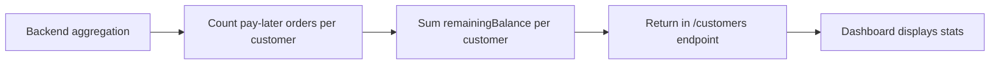

# Pay Later - Dashboard Reference

**Feature**: Pay Later Orders (Pagar Después)
**Status**: ✅ Production Ready
**Last Updated**: 2025-12-22

---

## 📖 Documentation

For complete Pay Later documentation, see:

- **Overview & Index**: `avoqado-tpv/docs/PAY_LATER_README.md`
- **Backend Classification**: `avoqado-server/docs/PAY_LATER_ORDER_CLASSIFICATION.md`
- **Android Implementation**: `avoqado-tpv/docs/PAY_LATER_IMPLEMENTATION.md`
- **Testing Checklist**: `avoqado-tpv/docs/PAY_LATER_TESTING_CHECKLIST.md`

---

## 🎯 Quick Overview

**Pay Later** allows restaurants to create orders and defer payment to a later time, linked to an identified customer.

### Classification Rule

An order is **pay-later** if:

```typescript
order.paymentStatus === 'PENDING' || order.paymentStatus === 'PARTIAL'
AND
order.orderCustomers.length > 0
AND
order.remainingBalance > 0
```

---

## 🖥️ Dashboard Features

### 1. Orders Page: Pay Later Filter

**Location**: `/dashboard/orders`

**UI**: Toggle button "Pagar Después"
- **State**: `variant` toggles between `outline` (inactive) and `default` (active)
- **Behavior**: Filters orders to show ONLY pay-later orders

**Implementation**:
```tsx
// Frontend filtering (client-side)
const payLaterOrders = orders.filter(order =>
  order.orderCustomers && order.orderCustomers.length > 0 &&
  (order.paymentStatus === 'PENDING' || order.paymentStatus === 'PARTIAL')
)
```

---

### 2. Customers Page: Pending Stats

**Location**: `/dashboard/customers`

**Columns**:
- **Órdenes Pendientes**: Shows count of pay-later orders
  - Badge variant: `warning`
  - Example: "2 órdenes"

- **Saldo Pendiente**: Shows total outstanding balance
  - Text color: `orange-600`
  - Example: "$225.00"

**Backend Data**:
```typescript
GET /api/v1/dashboard/venues/:venueId/customers

{
  "firstName": "Juan",
  "lastName": "Pérez",
  "pendingOrderCount": 2,      // ← Pay-later orders count
  "pendingBalance": 225.00      // ← Total outstanding
}
```

---

### 3. Aging Report (Future)

**Location**: `/dashboard/reports/pay-later-aging`

**Buckets**:
- 0-30 days
- 31-60 days
- 61-90 days
- 90+ days

**Endpoint**: `GET /api/v1/dashboard/reports/pay-later-aging`

---

## 🔐 Permissions

### Dashboard Permissions

**View Pay-Later Orders**:
```typescript
Permission: 'orders:read'
Roles: MANAGER+
```

**View Aging Report**:
```typescript
Permission: 'tpv-reports:pay-later-aging' (custom)
Roles: ADMIN+
```

---

## 🎨 UI Patterns

### Filter Button State

```tsx
<Button
  variant={showPayLater ? "default" : "outline"}
  onClick={() => setShowPayLater(!showPayLater)}
>
  Pagar Después
  {payLaterCount > 0 && (
    <Badge variant="secondary" className="ml-2">
      {payLaterCount}
    </Badge>
  )}
</Button>
```

### Customer Pending Display

```tsx
// Órdenes Pendientes
{customer.pendingOrderCount > 0 ? (
  <Badge variant="warning">
    {customer.pendingOrderCount} {customer.pendingOrderCount === 1 ? 'orden' : 'órdenes'}
  </Badge>
) : (
  <span className="text-muted-foreground">—</span>
)}

// Saldo Pendiente
{customer.pendingBalance > 0 ? (
  <span className="text-orange-600 font-medium">
    ${customer.pendingBalance.toFixed(2)}
  </span>
) : (
  <span className="text-muted-foreground">$0.00</span>
)}
```

---

## 🔄 Data Flow

### Order List with Pay-Later Filter

```mermaid
graph LR
    A[User clicks "Pagar Después"] --> B[Toggle filter state]
    B --> C{Filter enabled?}
    C -->|Yes| D[Filter orders: orderCustomers.length > 0]
    C -->|No| E[Show all orders]
    D --> F[Display filtered list]
    E --> F
```

### Customer Pending Stats



---

## 🧪 Testing

### Test Filter Toggle

1. Navigate to `/dashboard/orders`
2. Click "Pagar Después" button
3. Verify:
   - ✅ Button variant changes to `default`
   - ✅ Table shows ONLY pay-later orders
   - ✅ Regular orders (no customer) are hidden

### Test Customer Stats

1. Create pay-later order for customer "Juan"
2. Navigate to `/dashboard/customers`
3. Find "Juan" in table
4. Verify:
   - ✅ "Órdenes Pendientes" shows count
   - ✅ "Saldo Pendiente" shows correct amount
   - ✅ Badge variant is `warning` (orange)

---

## 🐛 Common Issues

### Issue: Filter Shows Empty

**Symptom**: "Pagar Después" filter shows no orders even when pay-later orders exist

**Causes**:
1. Backend not returning `orderCustomers` field
   - **Fix**: Check Prisma query includes `orderCustomers` relation
2. Frontend filter logic incorrect
   - **Fix**: Verify `orderCustomers?.length > 0` check

**Debug**:
```bash
# Check backend response
curl -H "Authorization: Bearer $TOKEN" \
  http://localhost:3000/api/v1/dashboard/venues/$VENUE_ID/orders
# → Should include orderCustomers array
```

---

### Issue: Customer Stats Not Showing

**Symptom**: `pendingOrderCount` or `pendingBalance` missing or 0

**Causes**:
1. Backend aggregation not working
   - **Fix**: Check `customer.dashboard.service.ts` includes aggregation
2. Orders not linked to customer
   - **Fix**: Verify `OrderCustomer` junction table has records

**Debug**:
```sql
-- Check OrderCustomer linkage
SELECT o.orderNumber, c.firstName, oc.isPrimary
FROM orders o
JOIN order_customers oc ON o.id = oc.orderId
JOIN customers c ON oc.customerId = c.id
WHERE o.paymentStatus IN ('PENDING', 'PARTIAL')
```

---

## 📊 Metrics & Analytics

### Dashboard Queries

```typescript
// Count pay-later orders
const payLaterCount = await prisma.order.count({
  where: {
    venueId,
    paymentStatus: { in: ['PENDING', 'PARTIAL'] },
    orderCustomers: { some: {} },
  },
})

// Sum outstanding balance
const totalOutstanding = await prisma.order.aggregate({
  where: {
    venueId,
    paymentStatus: { in: ['PENDING', 'PARTIAL'] },
    orderCustomers: { some: {} },
  },
  _sum: {
    remainingBalance: true,
  },
})
```

---

## 🔗 Related Features

- **Customer Management**: See `avoqado-server/docs/clients&promotions/CUSTOMER_LOYALTY_PROMOTIONS_REFERENCE.md`
- **Order Classification**: See `avoqado-server/docs/PAY_LATER_ORDER_CLASSIFICATION.md`
- **Android Implementation**: See `avoqado-tpv/docs/PAY_LATER_IMPLEMENTATION.md`

---

**Maintainer**: Development Team
**Cross-repo Feature**: Backend + Android TPV + Dashboard
**Status**: ✅ Production Ready
